##### Linux环境下的network IO
- blocking IO
- nonblocking IO
- IO multiplexing
- signal driven IO(signal driven IO在实际中并不常用)
- asynchronous IO

##### IO发生时涉及的对象和步骤
对于一个network IO (这里我们以read举例)，它会涉及到两个系统对象，一个是调用这个IO的process (or thread)，另一个就是系统内核(kernel)。当一个read操作发生时，它会经历两个阶段：
- 等待数据准备 (Waiting for the data to be ready)
- 将数据从内核拷贝到进程中(Copying the data from the kernel to the process)

##### 1.阻塞IO（blocking IO）
在linux中，默认情况下所有的socket都是blocking，一个典型的读操作流程大概是这样：

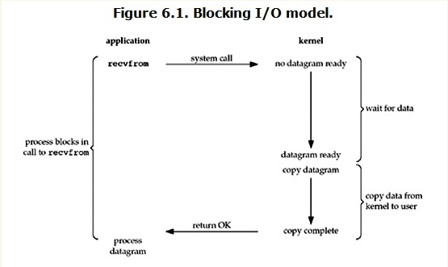

当用户进程调用了recvfrom这个系统调用，kernel就开始了IO的第一个阶段：准备数据。
对于network io来说，很多时候数据在一开始还没有到达（比如，还没有收到一个完整的UDP包）
，这个时候kernel就要等待足够的数据到来。而在用户进程这边，整个进程会被阻塞。
当kernel一直等到数据准备好了，它就会将数据从kernel中拷贝到用户内存，
然后kernel返回结果，用户进程才解除block的状态，重新运行起来。

所以，blocking IO的特点就是在IO执行的两个阶段（等待数据和拷贝数据两个阶段）都被block了。

网络编程都是从listen()、send()、recv() 等接口开始的，这些接口都是阻塞型的。
使用这些接口可以很方便的构建服务器/客户机的模型。下面是一个简单地“一问一答”的服务器。

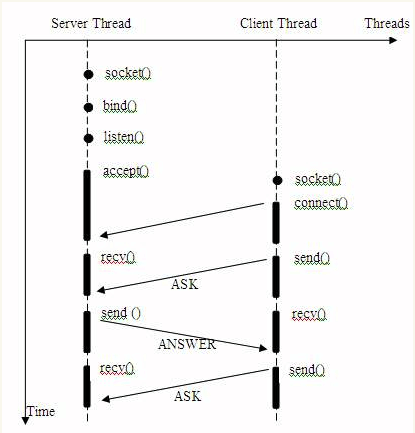

大部分的socket接口都是阻塞型的。所谓阻塞型接口是指系统调用（一般是IO接口）不返回调用结果并让当前线程一直阻塞，只有当该系统调用获得结果或者超时出错时才返回。

实际上，除非特别指定，几乎所有的IO接口 ( 包括socket接口 ) 都是阻塞型的。这给网络编程带来了一个很大的问题，如在调用send()的同时，线程将被阻塞，在此期间，线程将无法执行任何运算或响应任何的网络请求。

一个简单的改进方案是在服务器端使用多线程（或多进程）。多线程（或多进程）的目的是让每个连接都拥有独立的线程（或进程），这样任何一个连接的阻塞都不会影响其他的连接。具体使用多进程还是多线程，并没有一个特定的模式。传统意义上，进程的开销要远远大于线程，所以如果需要同时为较多的客户机提供服务，则不推荐使用多进程；如果单个服务执行体需要消耗较多的CPU资源，譬如需要进行大规模或长时间的数据运算或文件访问，则进程较为安全。通常，使用pthread_create ()创建新线程，fork()创建新进程。

我们假设对上述的服务器 / 客户机模型，提出更高的要求，即让服务器同时为多个客户机提供一问一答的服务。于是有了如下的模型。

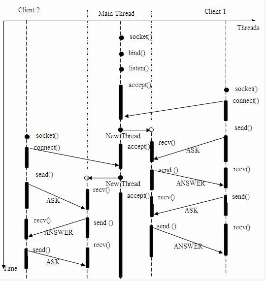

在上述的线程 / 时间图例中，主线程持续等待客户端的连接请求，如果有连接，则创建新线程，并在新线程中提供为前例同样的问答服务。

为何一个socket可以accept多次。实际上socket的设计者可能特意为多客户机的情况留下了伏笔，让accept()能够返回一个新的socket。下面是 accept 接口的原型：
```angular2html
 int accept(int s, struct sockaddr *addr, socklen_t *addrlen); 
```
输入参数s是从socket()，bind()和listen()中沿用下来的socket句柄值。执行完bind()和listen()后，操作系统已经开始在指定的端口处监听所有的连接请求，如果有请求，则将该连接请求加入请求队列。调用accept()接口正是从 socket s 的请求队列抽取第一个连接信息，创建一个与s同类的新的socket返回句柄。新的socket句柄即是后续read()和recv()的输入参数。如果请求队列当前没有请求，则accept() 将进入阻塞状态直到有请求进入队列。

上述多线程的服务器模型似乎完美的解决了为多个客户机提供问答服务的要求，但其实并不尽然。如果要同时响应成百上千路的连接请求，则无论多线程还是多进程都会严重占据系统资源，降低系统对外界响应效率，而线程与进程本身也更容易进入假死状态。

可能会考虑使用“线程池”或“连接池”。“线程池”旨在减少创建和销毁线程的频率，其维持一定合理数量的线程，并让空闲的线程重新承担新的执行任务。“连接池”维持连接的缓存池，尽量重用已有的连接、减少创建和关闭连接的频率。这两种技术都可以很好的降低系统开销，都被广泛应用很多大型系统，如websphere、tomcat和各种数据库等。但是，“线程池”和“连接池”技术也只是在一定程度上缓解了频繁调用IO接口带来的资源占用。而且，所谓“池”始终有其上限，当请求大大超过上限时，“池”构成的系统对外界的响应并不比没有池的时候效果好多少。所以使用“池”必须考虑其面临的响应规模，并根据响应规模调整“池”的大小。

对应上例中的所面临的可能同时出现的上千甚至上万次的客户端请求，“线程池”或“连接池”或许可以缓解部分压力，但是不能解决所有问题。总之，多线程模型可以方便高效的解决小规模的服务请求，但面对大规模的服务请求，多线程模型也会遇到瓶颈，可以用非阻塞接口来尝试解决这个问题。

##### 2.非阻塞IO（non-blocking IO）
Linux下，可以通过设置socket使其变为non-blocking。当对一个non-blocking socket执行读操作时，流程是这个样子：

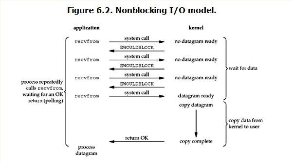

从图中可以看出，当用户进程发出read操作时，如果kernel中的数据还没有准备好，那么它并不会block用户进程，而是立刻返回一个error。从用户进程角度讲 ，它发起一个read操作后，并不需要等待，而是马上就得到了一个结果。用户进程判断结果是一个error时，它就知道数据还没有准备好，于是它可以再次发送read操作。一旦kernel中的数据准备好了，并且又再次收到了用户进程的system call，那么它马上就将数据拷贝到了用户内存，然后返回。

所以，在非阻塞式IO中，用户进程其实是需要不断的主动询问kernel数据准备好了没有。

非阻塞的接口相比于阻塞型接口的显著差异在于，在被调用之后立即返回。使用如下的函数可以将某句柄fd设为非阻塞状态。
```angular2html
fcntl( fd, F_SETFL, O_NONBLOCK ); 
```

下面将给出只用一个线程，但能够同时从多个连接中检测数据是否送达，并且接受数据的模型。

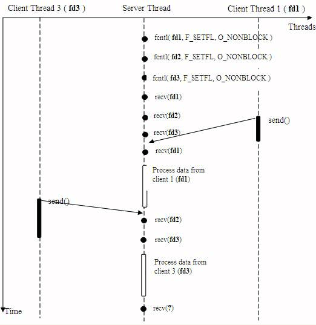

在非阻塞状态下，recv() 接口在被调用后立即返回，返回值代表了不同的含义。如在本例中:
```angular2html
* recv() 返回值大于 0，表示接受数据完毕，返回值即是接受到的字节数；
* recv() 返回 0，表示连接已经正常断开；
* recv() 返回 -1，且 errno 等于 EAGAIN，表示 recv 操作还没执行完成；
* recv() 返回 -1，且 errno 不等于 EAGAIN，表示 recv 操作遇到系统错误 errno
```
 可以看到服务器线程可以通过循环调用recv()接口，可以在单个线程内实现对所有连接的数据接收工作。但是上述模型绝不被推荐。因为，循环调用recv()将大幅度推高CPU 占用率；此外，在这个方案中recv()更多的是起到检测“操作是否完成”的作用，实际操作系统提供了更为高效的检测“操作是否完成“作用的接口，例如select()多路复用模式，可以一次检测多个连接是否活跃。
 
##### 3.多路复用IO（IO multiplexing）
IO multiplexing这个词可能有点陌生，但是如果我说select/epoll，大概就都能明白了。有些地方也称这种IO方式为事件驱动IO(event driven IO)。我们都知道，select/epoll的好处就在于单个process就可以同时处理多个网络连接的IO。它的基本原理就是select/epoll这个function会不断的轮询所负责的所有socket，当某个socket有数据到达了，就通知用户进程。它的流程如图：

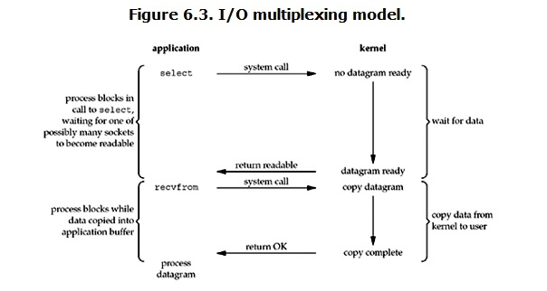

当用户进程调用了select，那么整个进程会被block，而同时，kernel会“监视”所有select负责的socket，当任何一个socket中的数据准备好了，select就会返回。这个时候用户进程再调用read操作，将数据从kernel拷贝到用户进程

这个图和blocking IO的图其实并没有太大的不同，事实上还更差一些。因为这里需要使用两个系统调用(select和recvfrom)，而blocking IO只调用了一个系统调用(recvfrom)。但是，用select的优势在于它可以同时处理多个connection。（所以，如果处理的连接数不是很高的话，使用select/epoll的web server不一定比使用multi-threading + blocking IO的web server性能更好，可能延迟还更大。select/epoll的优势并不是对于单个连接能处理得更快，而是在于能处理更多的连接。）

在多路复用模型中，对于每一个socket，一般都设置成为non-blocking，但是，如上图所示，整个用户的process其实是一直被block的。只不过process是被select这个函数block，而不是被socket IO给block。因此select()与非阻塞IO类似。

大部分Unix/Linux都支持select函数，该函数用于探测多个文件句柄的状态变化。下面给出select接口的原型：
```angular2html
FD_ZERO(int fd, fd_set* fds) 
FD_SET(int fd, fd_set* fds) 
FD_ISSET(int fd, fd_set* fds) 
FD_CLR(int fd, fd_set* fds) 
int select(int nfds, fd_set *readfds, fd_set *writefds, fd_set *exceptfds, 
struct timeval *timeout) 
```
这里，fd_set 类型可以简单的理解为按 bit 位标记句柄的队列，例如要在某 fd_set 中标记一个值为16的句柄，则该fd_set的第16个bit位被标记为1。具体的置位、验证可使用 FD_SET、FD_ISSET等宏实现。在select()函数中，readfds、writefds和exceptfds同时作为输入参数和输出参数。如果输入的readfds标记了16号句柄，则select()将检测16号句柄是否可读。在select()返回后，可以通过检查readfds有否标记16号句柄，来判断该“可读”事件是否发生。另外，用户可以设置timeout时间。

下面将重新模拟上例中从多个客户端接收数据的模型。

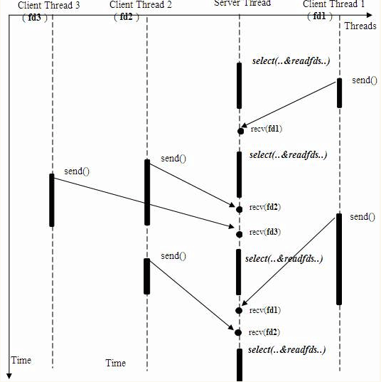

上述模型只是描述了使用select()接口同时从多个客户端接收数据的过程；由于select()接口可以同时对多个句柄进行读状态、写状态和错误状态的探测，所以可以很容易构建为多个客户端提供独立问答服务的服务器系统。如下图。

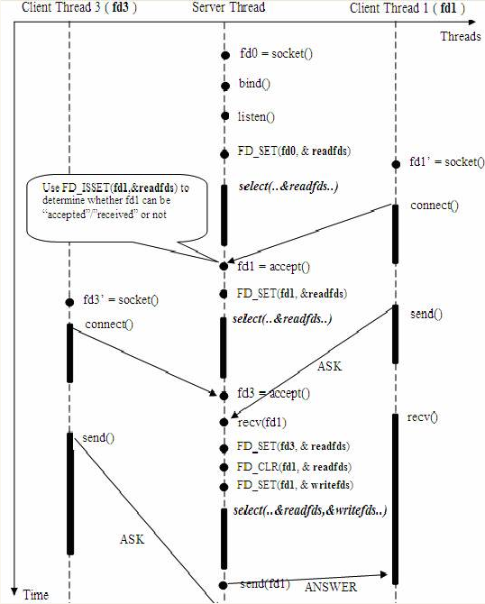

这里需要指出的是，客户端的一个 connect() 操作，将在服务器端激发一个“可读事件”，所以 select() 也能探测来自客户端的 connect() 行为。

上述模型中，最关键的地方是如何动态维护select()的三个参数readfds、writefds和exceptfds。作为输入参数，readfds应该标记所有的需要探测的“可读事件”的句柄，其中永远包括那个探测 connect() 的那个“母”句柄；同时，writefds 和 exceptfds 应该标记所有需要探测的“可写事件”和“错误事件”的句柄 ( 使用 FD_SET() 标记 )。

作为输出参数，readfds、writefds和exceptfds中的保存了 select() 捕捉到的所有事件的句柄值。程序员需要检查的所有的标记位 ( 使用FD_ISSET()检查 )，以确定到底哪些句柄发生了事件。

上述模型主要模拟的是“一问一答”的服务流程，所以如果select()发现某句柄捕捉到了“可读事件”，服务器程序应及时做recv()操作，并根据接收到的数据准备好待发送数据，并将对应的句柄值加入writefds，准备下一次的“可写事件”的select()探测。同样，如果select()发现某句柄捕捉到“可写事件”，则程序应及时做send()操作，并准备好下一次的“可读事件”探测准备。下图描述的是上述模型中的一个执行周期。

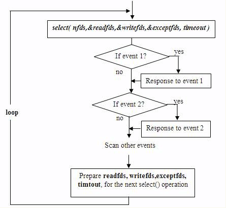

 这种模型的特征在于每一个执行周期都会探测一次或一组事件，一个特定的事件会触发某个特定的响应。我们可以将这种模型归类为“事件驱动模型”。
 
 相比其他模型，使用select() 的事件驱动模型只用单线程（进程）执行，占用资源少，不消耗太多 CPU，同时能够为多客户端提供服务。如果试图建立一个简单的事件驱动的服务器程序，这个模型有一定的参考价值。
 
 但这个模型依旧有着很多问题。首先select()接口并不是实现“事件驱动”的最好选择。因为当需要探测的句柄值较大时，select()接口本身需要消耗大量时间去轮询各个句柄。很多操作系统提供了更为高效的接口，如linux提供了epoll，BSD提供了kqueue，Solaris提供了/dev/poll，…。如果需要实现更高效的服务器程序，类似epoll这样的接口更被推荐。遗憾的是不同的操作系统特供的epoll接口有很大差异，所以使用类似于epoll的接口实现具有较好跨平台能力的服务器会比较困难。
 
  其次，该模型将事件探测和事件响应夹杂在一起，一旦事件响应的执行体庞大，则对整个模型是灾难性的。如下例，庞大的执行体1的将直接导致响应事件2的执行体迟迟得不到执行，并在很大程度上降低了事件探测的及时性。
  
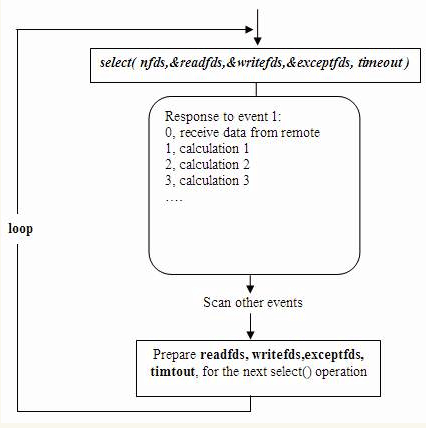

有很多高效的事件驱动库可以屏蔽上述的困难，常见的事件驱动库有libevent库，还有作为libevent替代者的libev库。这些库会根据操作系统的特点选择最合适的事件探测接口，并且加入了信号(signal) 等技术以支持异步响应，这使得这些库成为构建事件驱动模型的不二选择。下章将介绍如何使用libev库替换select或epoll接口，实现高效稳定的服务器模型。

实际上，Linux内核从2.6开始，也引入了支持异步响应的IO操作，如aio_read, aio_write，这就是异步IO。
 
##### 4.异步IO（Asynchronous I/O）
Linux下的asynchronous IO其实用得不多，从内核2.6版本才开始引入。先看一下它的流程：

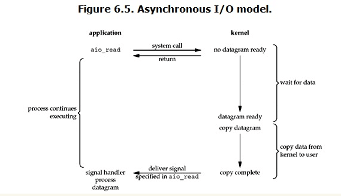

用户进程发起read操作之后，立刻就可以开始去做其它的事。而另一方面，从kernel的角度，当它受到一个asynchronous read之后，首先它会立刻返回，所以不会对用户进程产生任何block。然后，kernel会等待数据准备完成，然后将数据拷贝到用户内存，当这一切都完成之后，kernel会给用户进程发送一个signal，告诉它read操作完成了。

异步IO是真正非阻塞的，它不会对请求进程产生任何的阻塞，因此对高并发的网络服务器实现至关重要。

##### blocking和non-blocking的区别在哪
调用blocking IO会一直block住对应的进程直到操作完成，而non-blocking IO在kernel还在准备数据的情况下会立刻返回

##### synchronous IO和asynchronous IO的区别
两者的区别就在于synchronous IO做”IO operation”的时候会将process阻塞。按照这个定义，之前所述的blocking IO，non-blocking IO，IO multiplexing都属于synchronous IO。有人可能会说，non-blocking IO并没有被block啊。这里有个非常“狡猾”的地方，定义中所指的”IO operation”是指真实的IO操作，就是例子中的recvfrom这个系统调用。non-blocking IO在执行recvfrom这个系统调用的时候，如果kernel的数据没有准备好，这时候不会block进程。但是当kernel中数据准备好的时候，recvfrom会将数据从kernel拷贝到用户内存中，这个时候进程是被block了，在这段时间内进程是被block的。而asynchronous IO则不一样，当进程发起IO操作之后，就直接返回再也不理睬了，直到kernel发送一个信号，告诉进程说IO完成。在这整个过程中，进程完全没有被block。

还有一种不常用的signal driven IO，即信号驱动IO。总的来说，UNP中总结的IO模型有5种之多：阻塞IO，非阻塞IO，IO复用，信号驱动IO，异步IO。前四种都属于同步IO。阻塞IO不必说了。非阻塞IO ，IO请求时加上O_NONBLOCK一类的标志位，立刻返回，IO没有就绪会返回错误，需要请求进程主动轮询不断发IO请求直到返回正确。IO复用同非阻塞IO本质一样，不过利用了新的select系统调用，由内核来负责本来是请求进程该做的轮询操作。看似比非阻塞IO还多了一个系统调用开销，不过因为可以支持多路IO，才算提高了效率。信号驱动IO，调用sigaltion系统调用，当内核中IO数据就绪时以SIGIO信号通知请求进程，请求进程再把数据从内核读入到用户空间，这一步是阻塞的。
异步IO，如定义所说，不会因为IO操作阻塞，IO操作全部完成才通知请求进程。

各个IO Model的比较如图所示：

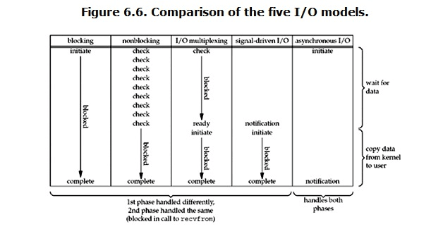

 经过上面的介绍，会发现non-blocking IO和asynchronous IO的区别还是很明显的。在non-blocking IO中，虽然进程大部分时间都不会被block，但是它仍然要求进程去主动的check，并且当数据准备完成以后，也需要进程主动的再次调用recvfrom来将数据拷贝到用户内存。而asynchronous IO则完全不同。它就像是用户进程将整个IO操作交给了他人（kernel）完成，然后他人做完后发信号通知。在此期间，用户进程不需要去检查IO操作的状态，也不需要主动的去拷贝数据。
 
 


