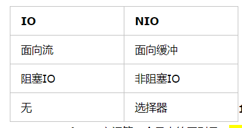

##### 同步与异步
- 同步 由线程本身去轮询IO 事件是否就绪
- 异步 由IO事件通知线程本身IO事件是否准备就绪

##### 阻塞与非阻塞
- 阻塞 线程在等待 IO 的时候，不可以同时做其他任务
- 非阻塞 线程在等待 IO 的时候，可以同时做其他任务

##### NIO和IO的主要区别

Java IO和NIO之间第一个最大的区别是，IO是面向流的，NIO是面向缓冲区的。 
Java IO面向流意味着每次从流中读一个或多个字节，直至读取所有字节，它们没有被缓存在任何地方。
此外，它不能前后移动流中的数据。如果需要前后移动从流中读取的数据，需要先将它缓存到一个缓冲区。
 Java NIO的缓冲导向方法略有不同。数据读取到一个它稍后处理的缓冲区，需要时可在缓冲区中前后移动。
 这就增加了处理过程中的灵活性。但是，还需要检查是否该缓冲区中包含所有您需要处理的数据。
 而且，需确保当更多的数据读入缓冲区时，不要覆盖缓冲区里尚未处理的数据。
 
 Java IO的各种流是阻塞的。这意味着，当一个线程调用read() 或 write()时，该线程被阻塞，直到有一些数据被读取，
 或数据完全写入。该线程在此期间不能再干任何事情了。Java NIO的非阻塞模式，使一个线程从某通道发送请求读取数据，
 但是它仅能得到目前可用的数据，如果目前没有数据可用时，就什么都不会获取，而不是保持线程阻塞，
 所以直至数据变的可以读取之前，该线程可以继续做其他的事情。 非阻塞写也是如此。一个线程请求写入一些数据到某通道，
 但不需要等待它完全写入，这个线程同时可以去做别的事情。 线程通常将非阻塞IO的空闲时间用于在其它通道上执行IO操作，
 所以一个单独的线程现在可以管理多个输入和输出通道（channel）。
 
 Java NIO的选择器允许一个单独的线程来监视多个输入通道，你可以注册多个通道使用一个选择器(selectors)，
 然后使用一个单独的线程来“选择”通道：这些通道里已经有可以处理的输入，
 或者选择已准备写入的通道。这种选择机制，使得一个单独的线程很容易来管理多个通道。
 
 ##### NIO选择器Selector
 通道和缓冲区的机制，使得线程无需阻塞地等待IO事件的就绪，
 但是总是要有人来监管这些IO事件。这个工作就交给了selector来完成，这就是所谓的同步
 
 Selector允许单线程处理多个 Channel。
 如果你的应用打开了多个连接（通道），但每个连接的流量都很低，使用Selector就会很方便。
 
 要使用Selector，得向Selector注册Channel，然后调用它的select()方法。
 这个方法会一直阻塞到某个注册的通道有事件就绪，这就是所说的轮询。一旦这个方法返回，线程就可以处理这些事件。
 
 Selector中注册的感兴趣事件有：
 
 - OP_ACCEPT
 
 - OP_CONNECT 
 
 - OP_READ 
 
 - OP_WRITE
 
 一种优化方式是：将Selector进一步分解为Reactor，将不同的感兴趣事件分开，
 每一个Reactor只负责一种感兴趣的事件。这样做的好处是：
 1、分离阻塞级别，减少了轮询的时间；2、线程无需遍历set以找到自己感兴趣的事件，因为得到的set中仅包含自己感兴趣的事件。