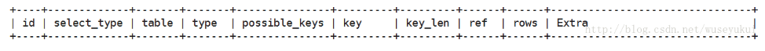
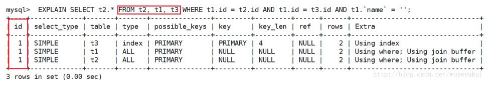
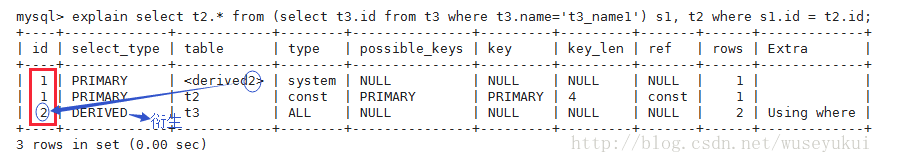
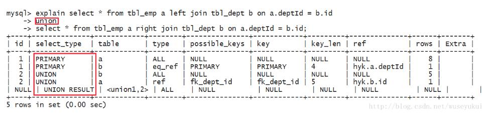
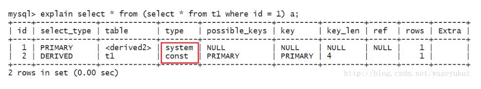

### 使用explain关键字可以模拟优化器执行SQL查询语句，从而知道MySQL是如何处理你的SQL语句的，分析你的查询语句或是表结构的性能瓶颈
explain执行计划包含的信息



其中最重要的字段为：id、type、key、rows、Extra

### 各字段详解
##### 1.id
select查询的序列号，包含一组数字，表示查询中执行select子句或操作表的顺序，三种情况： 
- id相同：执行顺序由上至下 



- id不同：如果是子查询，id的序号会递增，id值越大优先级越高，越先被执行 


- id相同又不同（两种情况同时存在）：id如果相同，可以认为是一组，从上往下顺序执行；在所有组中，id值越大，优先级越高，越先执行



##### 2.select_type
查询的类型，主要是用于区分普通查询、联合查询、子查询等复杂的查询
```angular2html
1、SIMPLE：简单的select查询，查询中不包含子查询或者union 
2、PRIMARY：查询中包含任何复杂的子部分，最外层查询则被标记为primary 
3、SUBQUERY：在select 或 where列表中包含了子查询 
4、DERIVED：在from列表中包含的子查询被标记为derived（衍生），mysql或递归执行这些子查询，把结果放在零时表里 
5、UNION：若第二个select出现在union之后，则被标记为union；若union包含在from子句的子查询中，外层select将被标记为derived 
6、UNION RESULT：从union表获取结果的select
```


##### 3.type
访问类型，sql查询优化中一个很重要的指标，结果值从好到坏依次是：
```angular2html
system > const > eq_ref > ref > fulltext > ref_or_null > index_merge > unique_subquery > index_subquery > range > index > ALL
```
一般来说，好的sql查询至少达到range级别，最好能达到ref
- system：表只有一行记录（等于系统表），这是const类型的特例，平时不会出现，可以忽略不计
- const：表示通过索引一次就找到了，const用于比较primary key 或者 unique索引。因为只需匹配一行数据，所有很快。如果将主键置于where列表中，mysql就能将该查询转换为一个const 

- eq_ref：唯一性索引扫描，对于每个索引键，表中只有一条记录与之匹配。常见于主键 或 唯一索引扫描。
 
