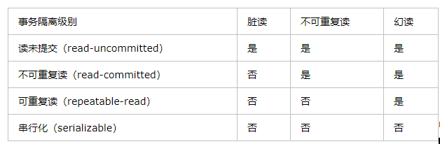
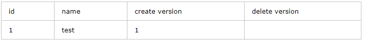
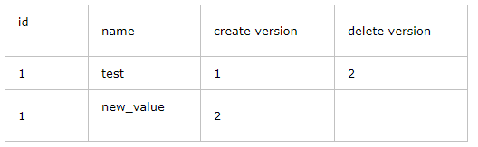
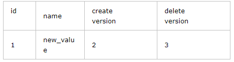

### ACDI
- 原子性：不可分割的工作单元
- 一致性：数据库总是从一个一致性的状态转换到另一个一致性的状态
- 隔离性：相对于隔离级别来说
- 持久性：一旦事务提交，所作的修改将永久保存到数据库中
### 事务的并发问题
- 脏读：事务A读取了事务B更新的数据，然后B回滚操作，那么A读取到的数据是脏数据

- 不可重复读：事务 A 多次读取同一数据，事务 B 在事务A多次读取的过程中，对数据作了更新并提交，导致事务A多次读取同一数据时，结果 不一致。

- 幻读：系统管理员A将数据库中所有学生的成绩从具体分数改为ABCDE等级，但是系统管理员B就在这个时候插入了一条具体分数的记录，当系统管理员A改结束后发现还有一条记录没有改过来，就好像发生了幻觉一样，这就叫幻读。

小结：不可重复读的和幻读很容易混淆，不可重复读侧重于修改，幻读侧重于新增或删除。解决不可重复读的问题只需锁住满足条件的行，解决幻读需要锁表
### MySQL事务隔离级别

### 事务日志
事务日志可以帮助提高事务的效率。使用事务日志，存储引擎在修改表的数据时只需要修改其内存拷贝，再把该修改行为记录到持久在硬盘上的事务日志中，而不用每次都将修改数据本身持久到磁盘。事务日志采用的是追加的方式，因此写日志的操作是磁盘上一小块区域内的顺序I/O，而不像随机I/O需要在磁盘的多个地方移动磁头，所有采用事务日志的方式相对来说要快得多。事务日志持久以后，内存中被修改的数据在后台可以慢慢地刷回到磁盘。目前大多数存储引擎都是这样实现的，我们通常称之为预写式日志（Write-Ahead Logging）,修改数据需要写两次磁盘。

如果数据的修改已经记录到事务日志并持久化，但数据本身没有写回磁盘，此时系统崩溃，存储引擎在重启时能够自动恢复这部分修改的数据。具体的恢复方式则视存储引擎而定。

### innodb采用的是行锁，而且采用了多版本并发控制来提高读操作的性能
在每一行记录的后面增加两个隐藏列，记录创建版本号和删除版本号

而每一个事务在启动的时候，都有一个唯一的递增的版本号。

- 在插入操作时 ： 记录的创建版本号就是事务版本号。 

比如我插入一条记录, 事务id 假设是1 ，那么记录如下：也就是说，创建版本号就是事务版本号

- 在更新操作的时候，采用的是先标记旧的那行记录为已删除，并且删除版本号是事务版本号，然后插入一行新的记录的方式。 

比如，针对上面那行记录，事务Id为2 要把name字段更新

update table set name= 'new_value' where id=1;

- 删除操作的时候，就把事务版本号作为删除版本号。比如

delete from table where id=1; 

- 查询操作： 

在查询时要符合以下两个条件的记录才能被事务查询出来：

1) 删除版本号 大于 当前事务版本号，就是说删除操作是在当前事务启动之后做的。 

2) 创建版本号 小于或者等于 当前事务版本号 ，就是说记录创建是在事务中（等于的情况）或者事务启动之前。

