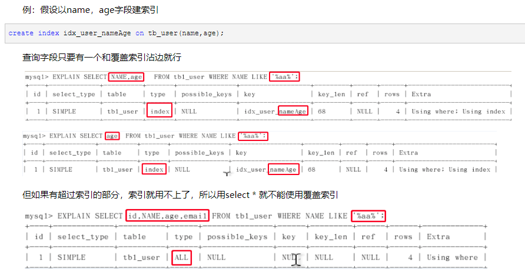
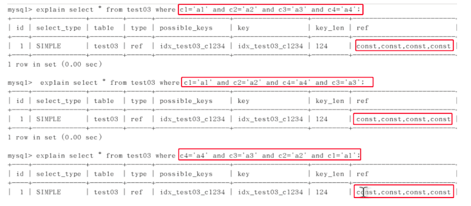
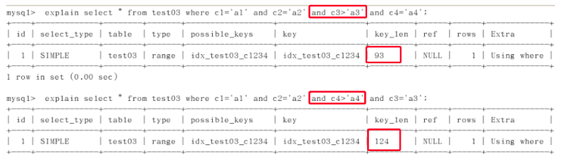

### B+Tree索引命中规则
- 全值匹配:where条件后的条件顺序、个数与索引一致
- 最佳左前缀法则：查询从索引的最左前列开始并且不跳过索引中的列，中间跳过的值，后面的索引会失效
- 索引列上做了操作（计算、函数、自动或手动类型转换），会导致索引失效而转向全表扫描
- 存储引擎不能使用索引中范围条件右边的列
- 尽量使用覆盖索引（索引列和查询列一致），减少select *
- mysql在使用不等于（!= 或 <>）时无法使用索引,is null，is not null也无法使用索引,
- like以通配符开头（‘%abc..’）也会导致索引失效

通过覆盖索引可以解决like '%字符串%'索引失效的问题



- 少用or，用它来连接时会索引失效

- 少数据值的列也不应该增加索引，只有两种情况，且平均分布，加了索引反而降低速度
- range的包含范围有一定的阈值，超过会进行全文扫描

### in与exists使用场合
```angular2html
select * from A where id in (select id from B)
#等价于：
　　for select id from B
　　for select * from A where A.id = B.id
``` 
- in：当A表的数据集大于B表的数据集时，in优于exists 
- exists：当A表的数据集小于B表的数据集时，exists优于in

### 对Order By的优化
- 用order by子句的重点是是否会产生filesort。建索引时已经排好序，所以order by的顺序和索引最好一致，避免再一次排序。　   
- 状态最好是using index，让mysql通过扫描索引本身完成排序。

能使用index方式排序的情况：order by语句使用索引最左前列，或where子句与order子句条件组合满足索引最左前列。

### group by
适用order by原则，实质先排序后分组，遵守索引建的最佳左前缀，使用不当会产生临时表。

### 其他注意点
假如以c1,c2,c3,c4的顺序建立索引

- 对于常量类型，查询优化器会自动调优SQL，顺序不影响



- 范围之后全失效，但查询优化器会先常量类型自动调优，c3被调前，c4后的失效，但c4是最后一个了，所以仍用到4个。以上的例子中间并没有断


