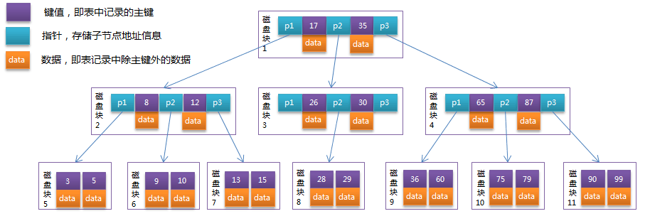
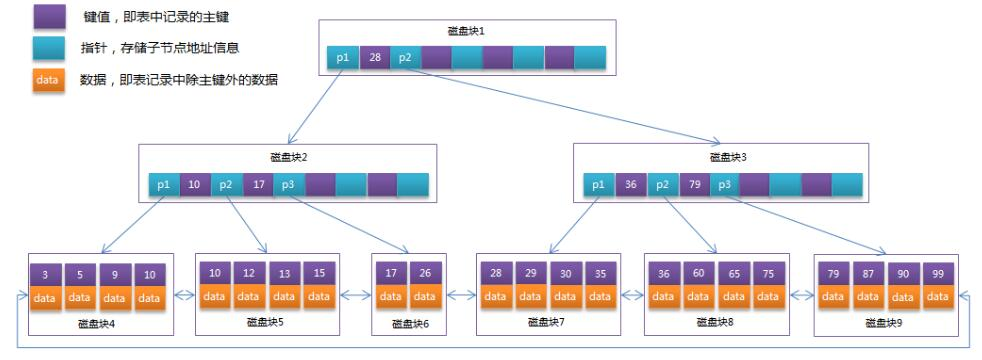

### 磁盘的相关知识
系统从磁盘读取数据到内存时是以磁盘块（block）为基本单位的，位于同一个磁盘块中的数据会被一次性读取出来，而不是需要什么取什么。

InnoDB存储引擎中有页（Page）的概念，页是其磁盘管理的最小单位。InnoDB存储引擎中默认每个页的大小为16KB，可通过参数innodb_page_size将页的大小设置为4K、8K、16K，

而系统一个磁盘块的存储空间往往没有这么大，因此InnoDB每次申请磁盘空间时都会是若干地址连续磁盘块来达到页的大小16KB。InnoDB在把磁盘数据读入到磁盘时会以页为基本单位，在查询数据时如果一个页中的每条数据都能有助于定位数据记录的位置，这将会减少磁盘I/O次数，提高查询效率。

B-Tree结构的数据可以让系统高效的找到数据所在的磁盘块。为了描述B-Tree，首先定义一条记录为一个二元组[key, data] ，key为记录的键值，对应表中的主键值，data为一行记录中除主键外的数据。对于不同的记录，key值互不相同。

### B-Tree索引
一棵m阶的B-Tree有如下特性：
```angularjs
1. 每个节点最多有m个孩子。 
2. 除了根节点和叶子节点外，其它每个节点至少有Ceil(m/2)个孩子。 
3. 若根节点不是叶子节点，则至少有2个孩子 
4. 所有叶子节点都在同一层，且不包含其它关键字信息 
5. 每个非终端节点包含n个关键字信息（P0,P1,…Pn, k1,…kn） 
6. 关键字的个数n满足：ceil(m/2)-1 <= n <= m-1 
7. ki(i=1,…n)为关键字，且关键字升序排序。 
8. Pi(i=1,…n)为指向子树根节点的指针。P(i-1)指向的子树的所有节点关键字均小于ki，但都大于k(i-1)
```
B-Tree中的每个节点根据实际情况可以包含大量的关键字信息和分支，如下图所示为一个3阶的B-Tree



每个节点占用一个盘块的磁盘空间，一个节点上有两个升序排序的关键字和三个指向子树根节点的指针，指针存储的是子节点所在磁盘块的地址。两个关键词划分成的三个范围域对应三个指针指向的子树的数据的范围域。以根节点为例，关键字为17和35，P1指针指向的子树的数据范围为小于17，P2指针指向的子树的数据范围为17~35，P3指针指向的子树的数据范围为大于35。

模拟查找关键字29的过程：
```angularjs
1.根据根节点找到磁盘块1，读入内存。【磁盘I/O操作第1次】
2.比较关键字29在区间（17,35），找到磁盘块1的指针P2。
3.根据P2指针找到磁盘块3，读入内存。【磁盘I/O操作第2次】
4.比较关键字29在区间（26,30），找到磁盘块3的指针P2。
5.根据P2指针找到磁盘块8，读入内存。【磁盘I/O操作第3次】
6.在磁盘块8中的关键字列表中找到关键字29。
```
分析上面过程，发现需要3次磁盘I/O操作，和3次内存查找操作。由于内存中的关键字是一个有序表结构，可以利用二分法查找提高效率。而3次磁盘I/O操作是影响整个B-Tree查找效率的决定因素。B-Tree相对于AVLTree缩减了节点个数，使每次磁盘I/O取到内存的数据都发挥了作用，从而提高了查询效率。

### B+Tree
B+Tree是在B-Tree基础上的一种优化，使其更适合实现外存储索引结构，InnoDB存储引擎就是用B+Tree实现其索引结构。

从上一节中的B-Tree结构图中可以看到每个节点中不仅包含数据的key值，还有data值。而每一个页的存储空间是有限的，如果data数据较大时将会导致每个节点（即一个页）能存储的key的数量很小，当存储的数据量很大时同样会导致B-Tree的深度较大，增大查询时的磁盘I/O次数，进而影响查询效率。在B+Tree中，所有数据记录节点都是按照键值大小顺序存放在同一层的叶子节点上，而非叶子节点上只存储key值信息，这样可以大大加大每个节点存储的key值数量，降低B+Tree的高度。

B+Tree相对于B-Tree有几点不同：
```angularjs
1.非叶子节点只存储键值信息。
2.所有叶子节点之间都有一个链指针。
3.数据记录都存放在叶子节点中。
```
将上一节中的B-Tree优化，由于B+Tree的非叶子节点只存储键值信息，假设每个磁盘块能存储4个键值及指针信息，则变成B+Tree后其结构如下图所示：



通常在B+Tree上有两个头指针，一个指向根节点，另一个指向关键字最小的叶子节点，而且所有叶子节点（即数据节点）之间是一种链式环结构。因此可以对B+Tree进行两种查找运算：一种是对于主键的范围查找和分页查找，另一种是从根节点开始，进行随机查找。

数据库中的B+Tree索引可以分为聚集索引（clustered index）和辅助索引（secondary index）。上面的B+Tree示例图在数据库中的实现即为聚集索引，聚集索引的B+Tree中的叶子节点存放的是整张表的行记录数据。辅助索引与聚集索引的区别在于辅助索引的叶子节点并不包含行记录的全部数据，而是存储相应行数据的聚集索引键，即主键。当通过辅助索引来查询数据时，InnoDB存储引擎会遍历辅助索引找到主键，然后再通过主键在聚集索引中找到完整的行记录数据。

### 哈希索引
Memory引擎支持哈希索引
```angular2html
1.哈希索引基于哈希表实现，只有精确匹配索引所有列的查询才有效。
2.存储引擎会根据所有的索引计算出一个哈希码
3.哈希索引将所有的哈希码存储在索引中，同时在哈希表中保存指向每个数据行额指针。
4.因为索引只是只需要存储对应的哈希值，所以索引的结构十分紧凑，使得哈希表查询非常快。
```
哈希表有一下限制：
```angular2html
1.哈希索引只包含哈希值和行指针，而不存储字段值，所以不能使用索引中值来避免行读取
2.哈希索引不是按照索引顺序存储的，因此也无法用于排序
3.哈希索引不支持部分索引匹配，因为哈希索引是根据全部索引列计算的哈希码
4.哈希索引只支持等值比较查询，=、in、<=>，不支持范围查询例如where a>100
5.访问哈希索引非常快，除非是哈希冲突，当出现哈希冲突时，存储引擎必须遍历链表中所有的行指针，逐行比较，直到找到符合条件的行
```

验证“哈希索引基于哈希表实现，只有精确匹配索引所有列的查询才有效”
```angular2html
CREATE TABLE `white_user` (
`id` bigint(20) NOT NULL AUTO_INCREMENT,
`teacherEmail` varchar(30) DEFAULT NULL,
`whiteFlag` int(1) DEFAULT '0',
`creationTime` datetime DEFAULT NULL,
PRIMARY KEY (`id`),
KEY `PK_INDEX` (`teacherEmail`,`whiteFlag`) USING HASH
) ENGINE=MEMORY AUTO_INCREMENT=64 DEFAULT CHARSET=utf8;
```
针对以下四种情况：只有前两种可以使用到hash索引
```angular2html
第一种：EXPLAIN select id,t.teacherEmail from white_user t where whiteflag=1 and teacheremail='testdemo2';

第二种：EXPLAIN select id,t.teacherEmail from white_user t where teacheremail='testdemo2' and whiteflag=1 ;

第三种：EXPLAIN select id,t.teacherEmail from white_user t where teacheremail='testdemo2';

第四种：EXPLAIN select id,t.teacherEmail from white_user t where whiteflag=1 ;
```
Innodb引擎对哈希索引的使用

Innodb引擎有一个特殊的功能叫做“自适应哈希索引”，当Innodb注意到某些索引值被使用的非常频繁时，它会在内存中给予b-tree索引之上再创建一个哈希索引，这样就让b-tree索引页具有哈希索引的一些优点，比如快速哈希查找，这种完全自动的、内部的行文。

Innodb创建自定义哈希索引

建议使用CRC32哈希函数，不建议使用SHA1和MD5哈希函数，因为后两个函数得出的哈希码非常长，会浪费大量空间，做比较时也慢。但是SHA1和MD5哈希函数进行的是强加密函数，设计目标是最大限度的消除冲突。

举例：
```angular2html
CREATE TABLE `white_user` (
`id` bigint(20) NOT NULL AUTO_INCREMENT,
`teacherEmail` varchar(30) DEFAULT NULL,
`whiteFlag` int(1) DEFAULT '0',
`hashCode` varchar(255) DEFAULT NULL,
`creationTime` datetime DEFAULT NULL,
PRIMARY KEY (`id`),
KEY `PK_INDEX` (`teacherEmail`,`whiteFlag`) USING BTREE),
KEY `PK_HASHCODE` (`hashcode`) USING BTREE
) ENGINE=InnoDB AUTO_INCREMENT=64 DEFAULT CHARSET=utf8;
```
新增数据时，hashcode字段中应该存储CRC32(teacheremail)获得的哈希码

执行下面条件时，可以使用到
```angular2html
EXPLAIN select id,t.teacherEmail from white_user t where hashcode=CRC32('testdemo2') AND whiteflag=1 and teacheremail='testdemo2';
```

### 空间索引
MyISAM表支持空间索引,可以用作地图数据处理,无法使用前缀查询

### 全文索引
查找文中的关键词,而不是直接比较索引中的值,全文索引更类似于搜索引擎做的事情,不是简单的where条件匹配


