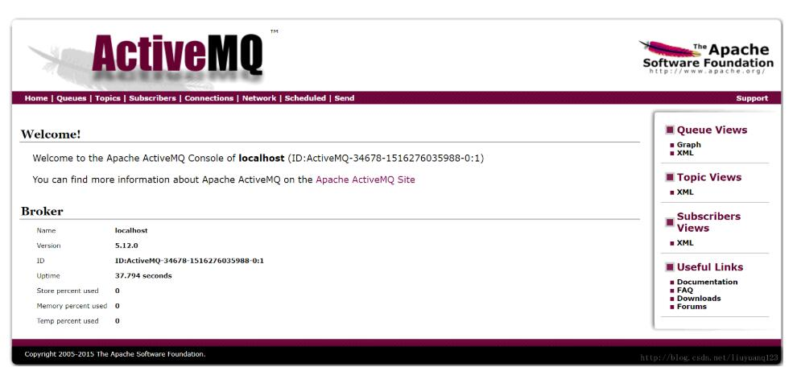
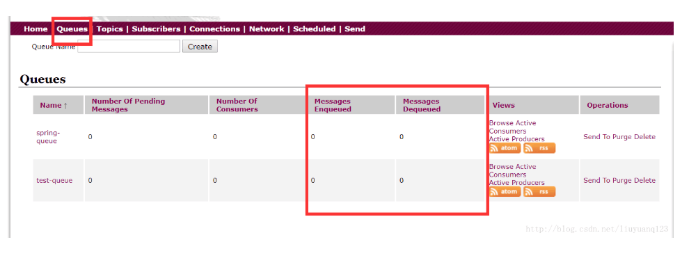

##### 下载安装
到解压后的bin目录
- 命令activemq start启动
- 命令activemq stop关闭
- 进入192.168.1.101:8161/admin进入管理后台默认用户名和密码都是admin

##### 启动后


然后点击queues可以看到现在没有一条消息：


##### ActiveMQ测试
编写一个测试类对ActiveMQ进行测试，首先得向pom文件中添加ActiveMQ相关的jar包：
```
   <dependency>  
         <groupId>org.apache.activemq</groupId>  
         <artifactId>activemq-all</artifactId>  
    </dependency> 
```
queue的发送代码如下:
```java
public class Test{
    public void testMQProducerQueue() throws Exception{
            //1、创建工厂连接对象，需要制定ip和端口号
            ConnectionFactory connectionFactory = new ActiveMQConnectionFactory("tcp://192.168.156.44:61616");
            //2、使用连接工厂创建一个连接对象
            Connection connection = connectionFactory.createConnection();
            //3、开启连接
            connection.start();
            //4、使用连接对象创建会话（session）对象
            Session session = connection.createSession(false, Session.AUTO_ACKNOWLEDGE);
            //5、创建队列（如果队列存在则不会创建，test-queue是队列名称），包含queue和topic（一对一和一对多）
            Queue queue = session.createQueue("test-queue");
            //6、使用会话对象创建生产者对象
            MessageProducer producer = session.createProducer(queue);
            //7、使用会话对象创建一个消息对象
            TextMessage textMessage = session.createTextMessage("hello!test-queue");
            //8、发送消息
            producer.send(textMessage);
            //9、关闭资源
            producer.close();
            session.close();
            connection.close();
        }
}
```
接收代码：
```java
public class Test{
    public void TestMQConsumerQueue() throws Exception{
            //1、创建工厂连接对象，需要制定ip和端口号
            ConnectionFactory connectionFactory = new ActiveMQConnectionFactory("tcp://192.168.156.44:61616");
            //2、使用连接工厂创建一个连接对象
            Connection connection = connectionFactory.createConnection();
            //3、开启连接
            connection.start();
            //4、使用连接对象创建会话（session）对象
            Session session = connection.createSession(false, Session.AUTO_ACKNOWLEDGE);
            //5、创建队列（如果队列存在则不会创建，test-queue是队列名称），包含queue和topic（一对一和一对多）
            Queue queue = session.createQueue("test-queue");
            //6、使用会话对象创建生产者对象
            MessageConsumer consumer = session.createConsumer(queue);
            //7、向consumer对象中设置一个messageListener对象，用来接收消息
            consumer.setMessageListener(new MessageListener() {
    
                @Override
                public void onMessage(Message message) {
                    // TODO Auto-generated method stub
                    if(message instanceof TextMessage){
                        TextMessage textMessage = (TextMessage)message;
                        try {
                            System.out.println(textMessage.getText());
                        } catch (JMSException e) {
                            // TODO Auto-generated catch block
                            e.printStackTrace();
                        }
                    }
                }
            });
            //8、程序等待接收用户消息
            System.in.read();
            //9、关闭资源
            consumer.close();
            session.close();
            connection.close();
        }
}
```


