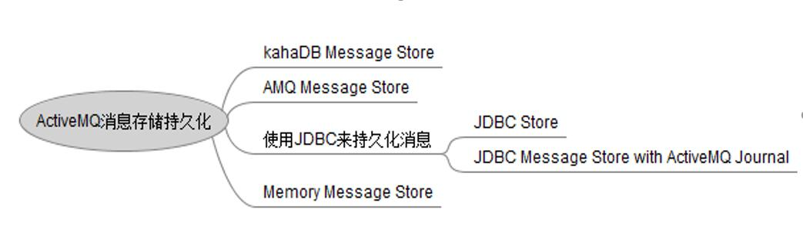

### 支持的传输协议
TCP,UDP,NIO,SSL,HTTPS,HTTP,VM

### 持久化存储


##### 1.kahaDB  默认的存储方式

在apache-activemq-5.15.0/conf/activemq.xml配置的
```angularjs
<persistenceAdapter>
    <kahaDB directory="${activemq.data}/kahadb"/>
</persistenceAdapter>
```

##### 2.AMQ 基于文件的存储方式

写入速度很快，容易恢复。

文件默认大小是32M
```angularjs
<persistenceAdapter>
    <amqPersistenceAdapter directory="" maxFileLength="32m" />
</persistenceAdapter>
```

##### 3.JDBC Store基于数据库的存储(性能要求不高)

ACTIVEMQ_ACKS ： 存储持久订阅的信息
```angularjs
如果是持久化Topic，订阅者和服务器的订阅关系在这个表保存：
主要的数据库字段如下：
CONTAINER：消息的Destination
SUB_DEST：如果是使用Static集群，这个字段会有集群其他系统的信息
CLIENT_ID：每个订阅者都必须有一个唯一的客户端ID用以区分
SUB_NAME：订阅者名称
SELECTOR：选择器，可以选择只消费满足条件的消息。条件可以用自定义属性实现，可支持多属性AND和OR操作
LAST_ACKED_ID：记录消费过的消息的ID。
```

ACTIVEMQ_LOCK ： 锁表（用来做集群的时候，实现master选举的表）
```angularjs
表activemq_lock在集群环境中才有用，只有一个Broker可以获得消息，称为Master Broker，
其他的只能作为备份等待Master Broker不可用，才可能成为下一个Master Broker。
这个表用于记录哪个Broker是当前的Master Broker。
```

ACTIVEMQ_MSGS ： 消息表
```angularjs
Queue和Topic都存储在这个表中：
ID：自增的数据库主键
CONTAINER：消息的Destination
MSGID_PROD：消息发送者客户端的主键
MSG_SEQ：是发送消息的顺序，MSGID_PROD+MSG_SEQ可以组成JMS的MessageID
EXPIRATION：消息的过期时间，存储的是从1970-01-01到现在的毫秒数
MSG：消息本体的Java序列化对象的二进制数据
PRIORITY：优先级，从0-9，数值越大优先级越高
```

第一步：
```angularjs
<persistenceAdapter>
    <jdbcPersistenceAdapter dataSource="#mysqlDataSource" createTablesOnStartup="fasle" />
</persistenceAdapter>
```
第二步：
```angularjs
<bean id="my-ds" class="org.apache.commons.dbcp2.BasicDataSource" destroy-method="close">
    <property name="driverClassName" value="com.mysql.jdbc.Driver" />
    <property name="url" value="jdbc:mysql://192.168.2.140:3306/activemq?characterEncoding=utf-8" />
    <property name="username" value="root" />
    <property name="password" value="123456" />
    <property name="initialSize" value="5" />
    <property name="maxTotal" value="100" />
    <property name="maxIdle" value="30" />
    <property name="maxWaitMillis" value="10000" />
    <property name="minIdle" value="1" />
</bean>
```

第三步：添加jar包依赖

主安装目录的lib目录下，将jar包放到该路径下

commons-dbcp-1.4.jar

commons-pool-1.6.jar

mysql-connector-java-5.1.35.jar

##### 4.JDBC Message store with activeMQ journal

1.	引入了快速缓存机制，缓存到Log文件中

2.	性能会比jdbc store要好

3.	JDBC Message store with activeMQ journal 不能应用于master/slave模式

4.	Memory 基于内存的存储

##### 5.LevelDB

5.8以后引入的持久化策略。通常用于集群配置


