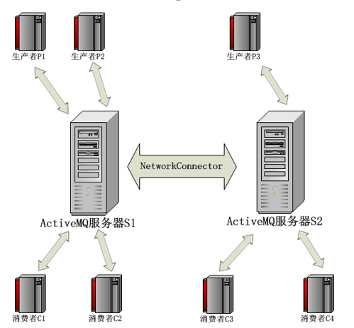

### ActiveMQ的网络连接
activeMQ如果要实现扩展性和高可用性的要求的话，就需要用用到网络连接模式

#### NetworkConnector
主要用来配置broker与broker之间的通信连接



如上图所示，服务器S1和S2通过NewworkConnector相连，则生产者P1发送消息，
消费者C3和C4都可以接收到，而生产者P3发送的消息，消费者C1和C2同样也可以接收到

提供两种链接方式：静态网络连接和动态网络连接

#### 静态网络连接
修改activemq.xml，增加如下内容,本地ip也需写上
```angularjs
<networkConnectors>
    <networkConnector uri="static://(tcp://192.168.1.101:61616,tcp://192.168.1.102:61616)" />
</networkConnectors>
```
两个Brokers通过一个staic的协议来进行网络连接。一个Consumer连接到BrokerB的一个地址上，当Producer在BrokerA上以相同的地址发送消息是，此时消息会被转移到BrokerB上，
也就是说BrokerA会转发消息到BrokerB上

丢失的消息

一些consumer连接到broker1、消费broker2上的消息。消息先被broker1从broker2消费掉，然后转发给这些consumers。假设，转发消息的时候broker1宕机了，
这些consumers发现brokers1连接失败，通过failover(连接失败自动连到其他borker上)连接到broker2.但是因为有一部分没有消费的消息被broker2已经分发到broker1上去了，这些消息就好像消失了。
除非有消费者重新连接到broker1上来消费

从5.6版本开始，在destinationPolicy上新增了一个选项replayWhenNoConsumers属性，这个属性可以用来解决当broker1上有需要转发的消息但是没有消费者时，把消息回流到它原始的broker。
同时把enableAudit设置为false，为了防止消息回流后被当作重复消息而不被分发通过如下配置，在activeMQ.xml中。 分别在两台服务器都配置。即可完成消息回流处理
```angularjs
<policEntry queue=">" enableAudit="false">
    <networkBridgeFilterFactory>
        <conditionalNetworkBridgeFilterFactory replayWhenNoConsumers="true"/>
    </networkBridgeFilterFactory>
</policEntry>
```


