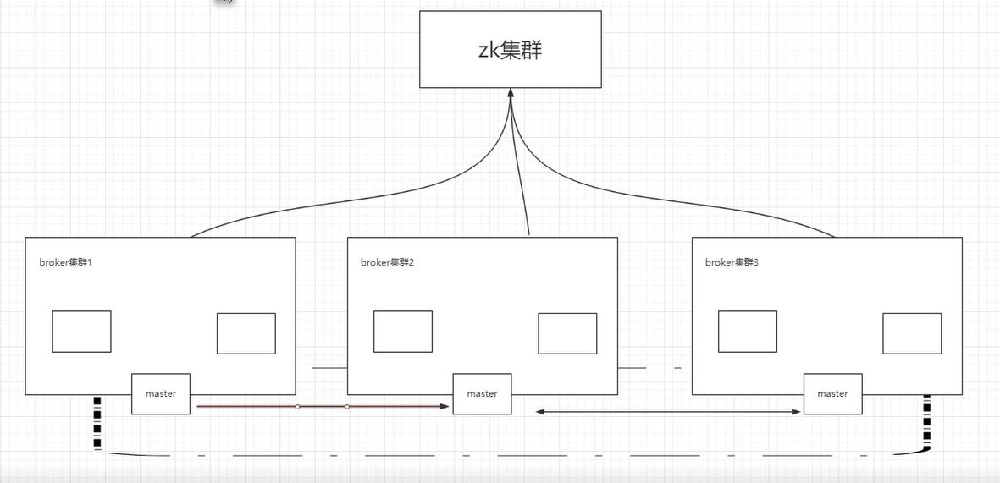

##### 容错的连接
两个broekr连接，若其中一台挂掉，其上的消费者则可以连接到另一个broker上
```java
ActiveMQconnectionFactory factory = new  ActiveMQconnectionFactory("failover:(tcp://192.169.1.100:61616,tcp://192.169.1.101:61616)?randomize=false")
```

##### zokeeoer+activemq实现高可用（master/slave模型）
- 1.conf/activemq.xml文件,把brokerName修改成统一的一个名称
```
<broker xmlns="http://activemq.apache.org/schema/core" brokerName="job-broker" dataDirectory="${activemq.data}">
```
- 2.修改conf/activemq.xml文件，找到persistenceAdapter，把旧的kahaDB注释掉，并加入新levelDB
```
<!--
<persistenceAdapter>
    <kahaDB directory="${activemq.data}/kahadb"/>
</persistenceAdapter>
-->
<persistenceAdapter>
    <replicatedLevelDB
      #levelDB数据文件存储的位置
      directory="${activemq.data}/leveldb"
      #计算公式（replicas/2）+1,当值是2，表示集群中至少是2台是启动的
      replicas="3"
      #负责slave和master的数据同步端口和ip
      bind="tcp://0.0.0.0:0:61615"
      zkAddress="192.168.199.71:2181,192.168.199.71:2181,192.168.199.71:2181"
      #本机ip
      hostname="192.168.199.71"
      sync="local_disk"
      zkPath="/activemq/leveldb-stores"
      />
</persistenceAdapter>
```

另外两台服务器分别重复上一步，只是hostname修改为自己的ip

分别启动三台服务器的mq

分别访问三个服务器的mq的控制台，只有一台能访问，证明配置成功　

### 高可用配置+高性能

　
