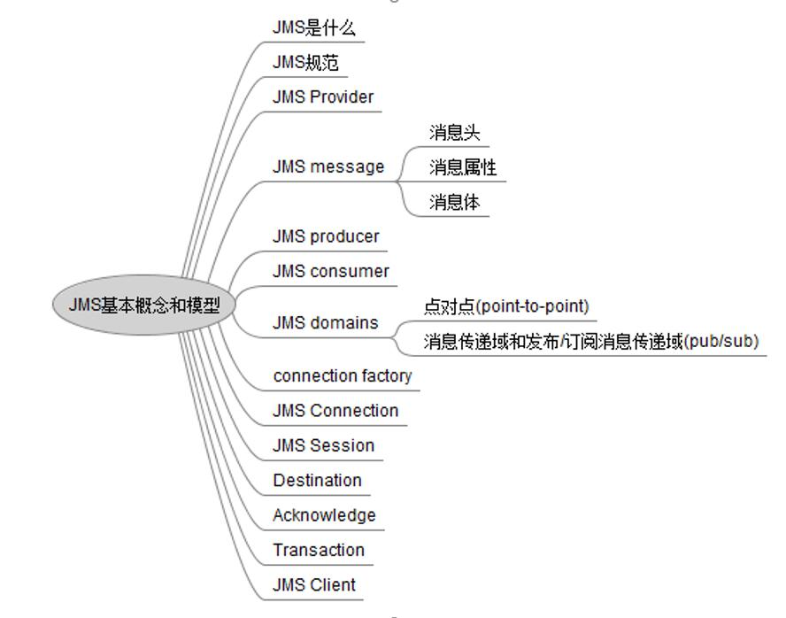
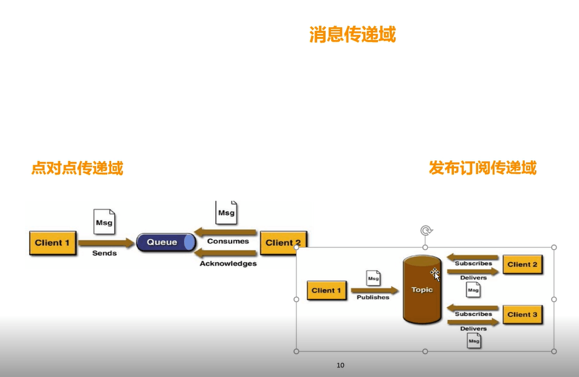

##### JMS的概念和规范


##### 消息传递域
点对点（P2P）
- 1.每个消息只能有一个消费者
- 2.消息的生产者和消费者之间没有时间上的相关性。无论消费者在生产者发送消息的时候是否处于运行状态，都可以提取消息

发布订阅(pub/sub)
- 1.每个消息可以有多个消费者
- 2.消息的生产者和消费者之间存在时间上的相关性，订阅一个主题的消费者只能消费自它订阅之后发布的消息。
JMS规范允许提供客户端创建持久订阅



##### JMS API 
- ConnectionFactory    连接工厂
- Connection    封装客户端与JMS provider之间的一个虚拟的连接
- Session	生产和消费消息的一个单线程上下文； 用于创建producer、consumer、message、queue..
- Destination	消息发送或者消息接收的目的地
- MessageProducer/consumer	消息生产者/消费者

##### 消息组成 
- 消息头

包含消息的识别信息和路由信息

- 消息体

TextMessage

MapMessage

BytesMessage

StreamMessage   输入输出流

ObjectMessage  可序列化对象

##### JMS的可靠性机制
JMS消息之后被确认后，才会认为是被成功消费。消息的消费包含三个阶段： 
客户端接收消息、客户端处理消息、消息被确认

- 事务性会话
```angularjs
Session session = connection.createSession(true, Session.AUTO_ACKNOWLEDGE);
```
设置为true的时候，消息会在session.commit以后自动签收
- 非事务性会话
```angularjs
Session session = connection.createSession(false, Session.AUTO_ACKNOWLEDGE);
```
在该模式下，消息何时被确认取决于创建会话时的应答模式
- AUTO_ACKNOWLEDGE
当客户端成功从recive方法返回以后，
或者[MessageListener.onMessage] 方法成功返回以后，会话会自动确认该消息 
- CLIENT_ACKNOWLEDGE
客户端通过调用消息的textMessage.acknowledge();确认消息。
在这种模式中，如果一个消息消费者消费一共是10个消息，那么消费了5个消息，
然后在第5个消息通过textMessage.acknowledge()，那么之前的所有消息都会被消确认
- DUPS_OK_ACKNOWLEDGE
延迟确认

- 本地事务
在一个JMS客户端，可以使用本地事务来组合消息的发送和接收。JMS Session 接口提供了commit和rollback方法。
JMS Provider会缓存每个生产者当前生产的所有消息，直到commit或者rollback，commit操作将会导致事务中所有的消息被持久存储；
rollback意味着JMS Provider将会清除此事务下所有的消息记录。在事务未提交之前，消息是不会被持久化存储的，也不会被消费者消费
事务提交意味着生产的所有消息都被发送。消费的所有消息都被确认； 
事务回滚意味着生产的所有消息被销毁，消费的所有消息被恢复，也就是下次仍然能够接收到发送端的消息，除非消息已经过期了

- JMS （pub/sub）模型

1.订阅可以分为非持久订阅和持久订阅

2.当所有的消息必须接收的时候，则需要用到持久订阅。反之，则用非持久订阅

- JMS （P2P）模型

1.如果session关闭时，有一些消息已经收到，但还没有被签收，那么当消费者下次连接到相同的队列时，消息还会被签收

2.如果用户在receive方法中设定了消息选择条件，那么不符合条件的消息会留在队列中不会被接收

3.队列可以长久保存消息直到消息被消费者签收。消费者不需要担心因为消息丢失而时刻与jms provider保持连接状态


