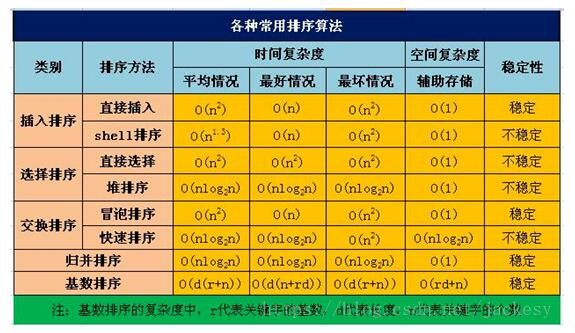
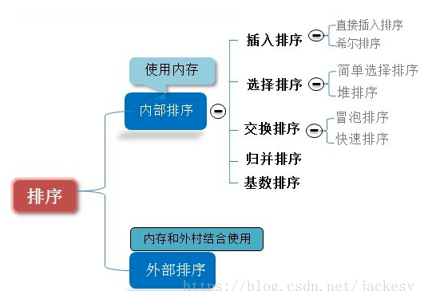

### 排序之间的关系
排序有内部排序和外部排序，内部排序是数据记录在内存中进行排序，而外部排序是因排序的数据很大，一次不能容纳全部的排序记录，在排序过程中需要访问外存。我们这里说说八大排序就是内部排序。



当n较大，则应采用时间复杂度为O(nlog2n)的排序方法：快速排序、堆排序或归并排序。

8种排序之间的关系:



当n较大，则应采用时间复杂度为O(nlog2n)的排序方法：快速排序、堆排序或归并排序序。快速排序：是目前基于比较的内部排序中被认为是最好的方法，当待排序的关键字是随机分布时，快速排序的平均时间最短。

### 直接插入
##### 基本思想
直接插入排序是将未排序的数据插入至已排好序序列的合适位置。

具体流程如下：
- 首先比较数组的前两个数据，并排序；
- 比较第三个元素与前两个排好序的数据，并将第三个元素放入适当的位置；
- 比较第四个元素与前三个排好序的数据，并将第四个元素放入适当的位置；
- 直至把最后一个元素放入适当的位置。

例子
```angularjs
{4,5,1,2,8,6,7,3,10,9} 
取无序区间的第一个，从右向左扫描有序区间比较，方括号内可视为有序区间。 
第一次：[4],5,1,2,8,6,7,3,10,9 
第二次：[4,5],1,2,8,6,7,3,10,9 
第三次：[1,4,5],2,8,6,7,3,10,9 
第四次：[1,2,4,5],8,6,7,3,10,9 
第五次：[1,2,4,5,8],6,7,3,10,9 
第六次：[1,2,4,5,6,8],7,3,10,9 
第七次：[1,2,4,5,6,7,8],3,10,9 
第八次：[1,2,3,4,5,6,7,8],10,9 
第九次：[1,2,3,4,5,6,7,8,10],9 
第十次：[1,2,3,4,5,6,7,8,9,10]
```

算法分析

直接插入排序算法的空间复杂度为O(1)。

最好的情况，要比较的无序序列原本就是顺序有序的，那么要比较的次数是n-1，移动了0次，时间复杂度O(n)。

最坏的情况，要比较的无序序列原本就是逆序有序的，那么要比较的次数是(n+2)(n-1)/2，移动的次数(n+4)(n-1)/2，时间复杂度O(n²)。

直接插入排序的平均复杂度为O(n²)。

直接插入排序是稳定的。

Java实现
```java
public class Test{
    public static void insertSort(int[] data){
       int temp;
       for (int i = 1; i < data.length; i++) {
            //待插入数据
           temp = data[i];
           int j;
           for(j = i - 1; j >= 0; j--) {
               //判断是否大于temp，大于则后移一位
               if(data[j] > temp) {
                    data[j+1] = data[j];
               }else{
                    break;
               }
           }
           data[j + 1] = temp;
        }
    }
}
```

### 希尔排序
##### 基本思想
希尔排序严格来说是基于插入排序的思想，又被称为缩小增量排序。具体流程如下：
- 1、将包含n个元素的数组，分成n/2个数组序列，第一个数据和第n/2+1个数据为一对...
- 2、对每对数据进行比较和交换，排好顺序；
- 3、然后分成n/4个数组序列，再次排序；
- 4、不断重复以上过程，随着序列减少并直至为1，排序完成。、

假如有初始数据：25  11 45  26  12  78。
1、第一轮排序，将该数组分成 6/2=3 个数组序列，第1个数据和第4个数据为一对，第2个数据和第5个数据为一对，第3个数据和第6个数据为一对，
每对数据进行比较排序，排序后顺序为：[25, 11, 45, 26,12, 78]。

2、第二轮排序，将上轮排序后的数组分成6/4=1个数组序列，此时逐个对数据比较，按照插入排序对该数组进行排序，排序后的顺序为：[11, 12, 25, 26, 45, 78]。

##### 算法分析
对于插入排序而言，如果原数组是基本有序的，那排序效率就可大大提高。另外，对于数量较小的序列使用直接插入排序，会因需要移动的数据量少，其效率也会提高。因此，希尔排序具有较高的执行效率。

希尔排序并不稳定，O(1)的额外空间，时间复杂度为O(n²)。
##### Java实现
```java
public class Test{
    public static voidshellSortSmallToBig(int[] data) {
    
       int j = 0;
    
       int temp = 0;
    
       for (int increment = data.length / 2; increment > 0; increment /= 2){
    
           for (int i = increment; i < data.length; i++) {
    
               temp = data[i];
    
               for (j = i - increment; j >= 0; j -= increment) {
    
                    if (temp < data[j]) {
    
                        data[j + increment] =data[j];
    
                    } else {
    
                        break;
    
                    }
    
               }
    
               data[j + increment] = temp;
    
           }
    
        }
    
    }
}
```


